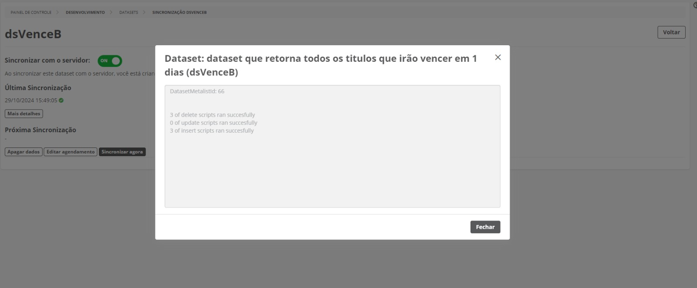
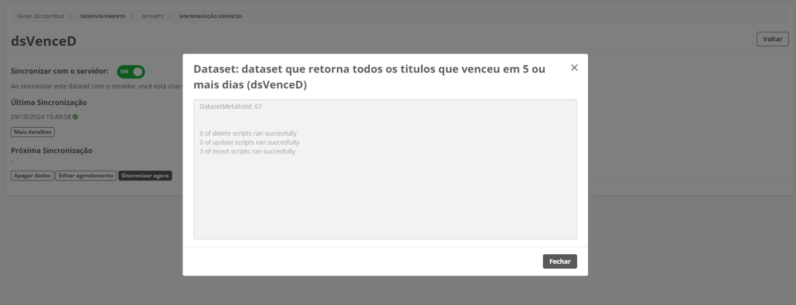
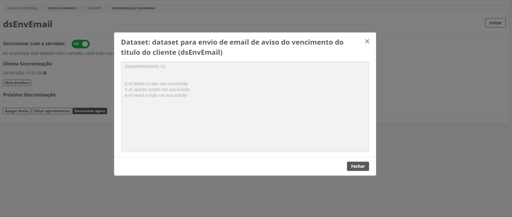
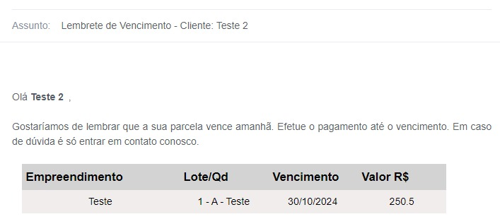
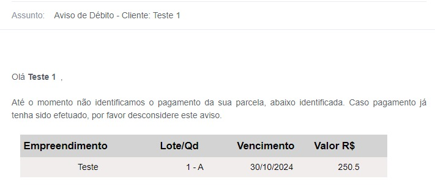
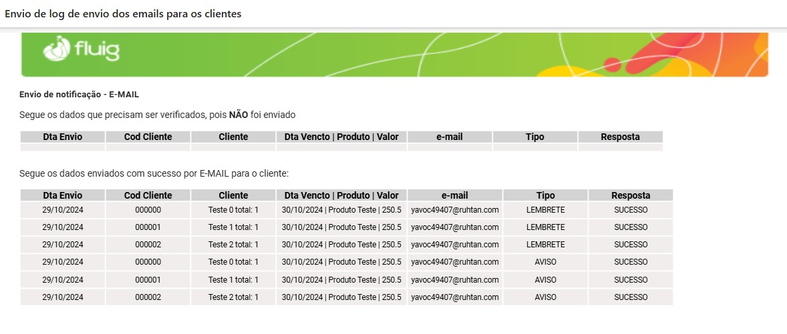

# 📧 Projeto de Envio de Notificações de Títulos - Fluig

Este projeto visa o envio de notificações de vencimento de títulos para os clientes, utilizando datasets integrados ao sistema Protheus. Foram desenvolvidos três datasets específicos que consultam informações sobre títulos a vencer e vencidos, além de um para envio de emails de aviso.

## 📂 Estrutura dos Datasets

1. **Dataset `dsVenceB`** - Este dataset realiza uma consulta no Protheus para obter todos os clientes cujos títulos irão vencer em **1 dia**. É utilizado para envio de lembretes de pagamento aos clientes, assegurando que estejam cientes dos vencimentos iminentes.
   

2. **Dataset `dsVenceD`** - Este dataset consulta no Protheus para obter os clientes cujos títulos estão vencidos há **5 dias**. O objetivo é identificar clientes em débito recente e enviar avisos de débito, incentivando-os a regularizar a situação.
   

3. **Dataset `dsEnvEmail`** - Dataset destinado ao envio de emails de notificação para os clientes. Este dataset envia tanto lembretes de vencimento quanto avisos de débito, dependendo do status do título consultado nos datasets anteriores.
   

## ✉️ Exemplo de Email de Notificação

### 🔔 Lembrete de Vencimento
Enviado aos clientes cujos títulos irão vencer em 1 dia, lembrando-os da data de vencimento para evitar inadimplência.

### ⚠️ Aviso de Débito
Enviado aos clientes que possuem títulos vencidos entre 4 a 5 dias, alertando-os da pendência e solicitando o pagamento.

## 📋 Log de Envio de Emails

O sistema também registra o log de envio de emails, permitindo verificar quais notificações foram enviadas com sucesso e quais precisam de verificação adicional.

## 🔄 Sincronização dos Datasets

Os datasets são sincronizados com o servidor em intervalos específicos para garantir que as informações estejam sempre atualizadas:

- `dsVenceB`: Sincronização realizada para obter os títulos a vencer em 1 dia.
- `dsVenceD`: Sincronização realizada para obter os títulos vencidos há 4 ou 5 dias.
- `dsEnvEmail`: Sincronização para realizar o envio de emails com base nas informações dos outros dois datasets.
